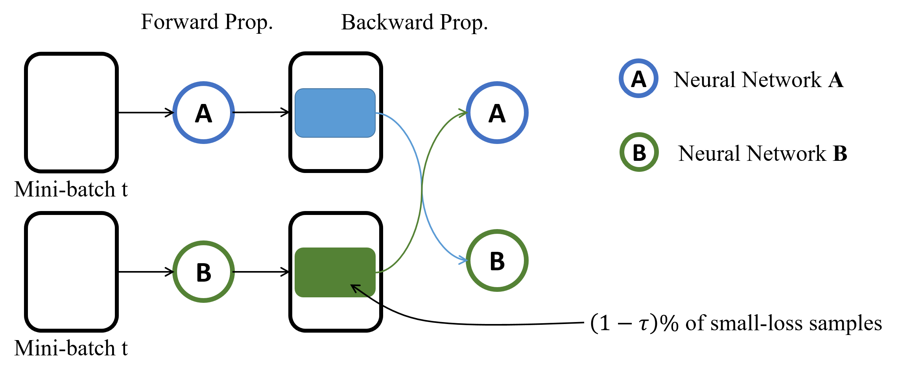

# Co-teaching - Robust training of deep neural networks with extremely noisy labels
Unofficial implementation of the CIFAR-10 learned by [Co-teaching](http://papers.nips.cc/paper/8072-co-teaching-robust-training-of-deep-neural-networks-with-extremely-noisy-labels).

> __Publication__  
> Han, B., Yao, Q., Yu, X., Niu, G., Xu, M., Hu, W., Tsang, I.,
and Sugiyama, M. Co-teaching: Robust training of deep
neural networks with extremely noisy labels," *Advances in Neural Information Processing Systems (NIPS)*, pp.
8536–8546, 2018.

## 1. Summary
For robust training on noisy labels, *Co-teaching* uses two neural networks. Each network selects its small-loss samples as clean samples, and feeds such clean samples to its peer network for futher training. Figure

## 2. Architecture

## 3. Example
